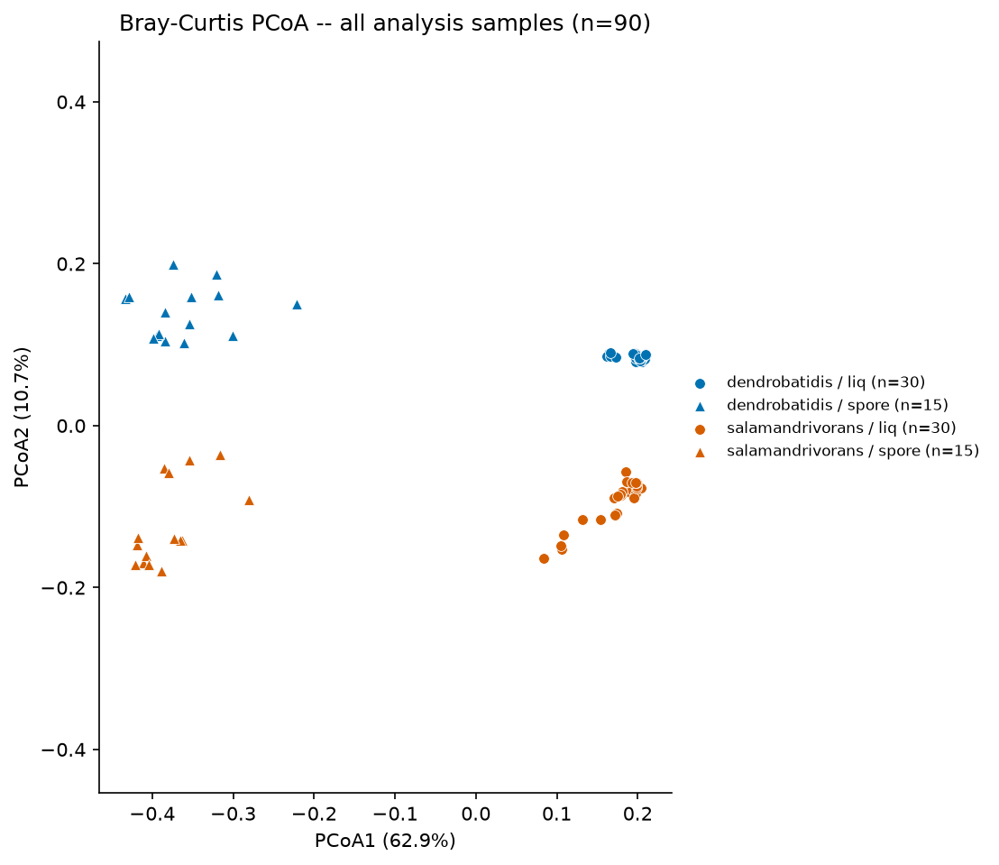
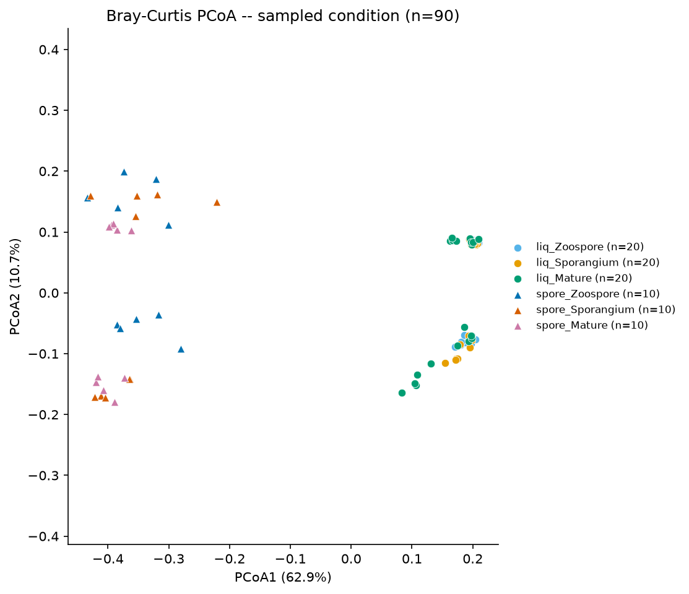
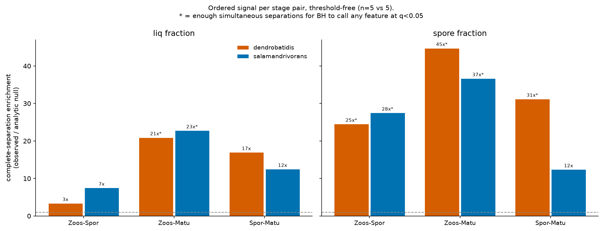
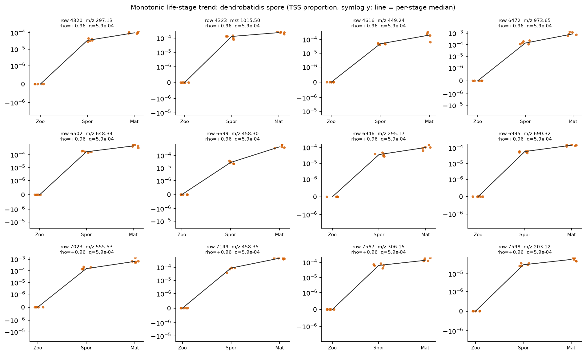
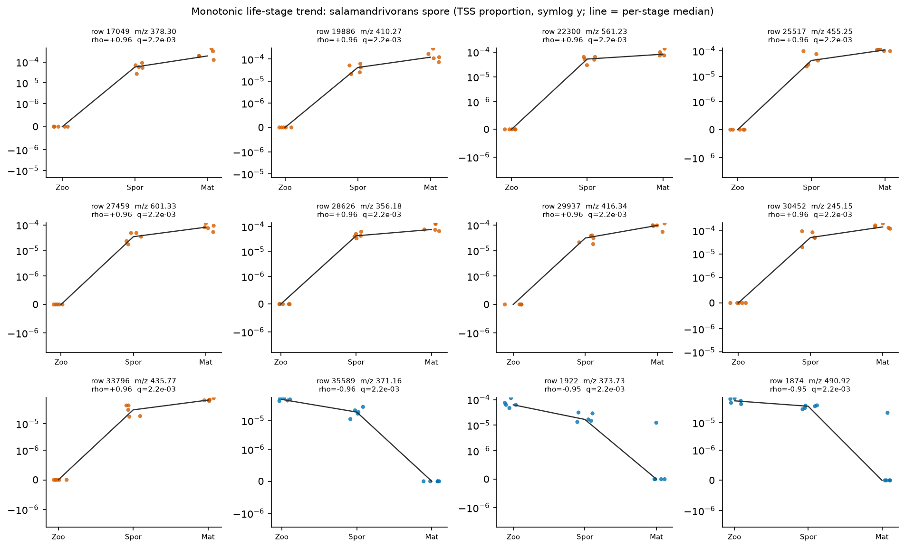
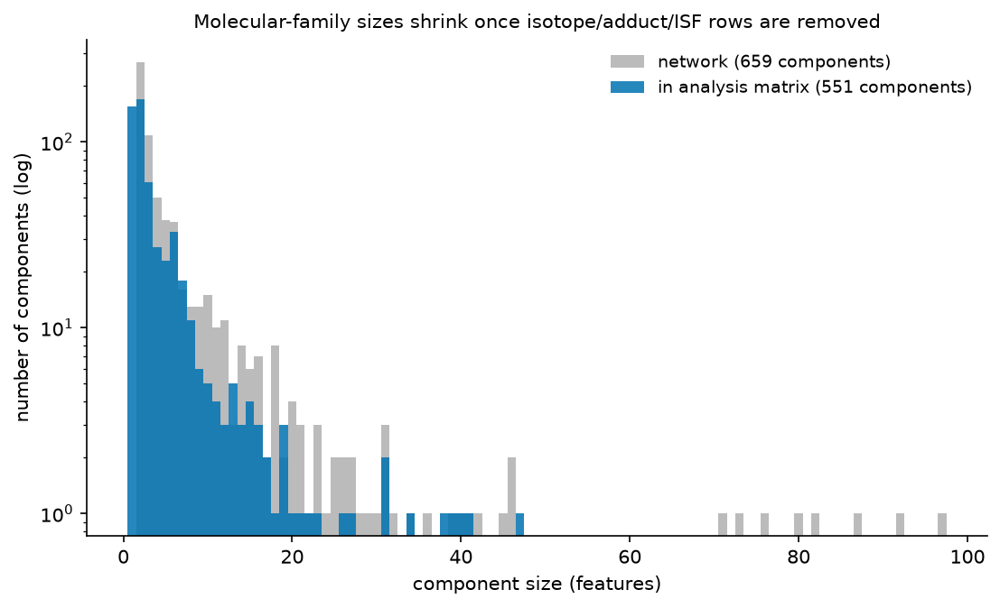
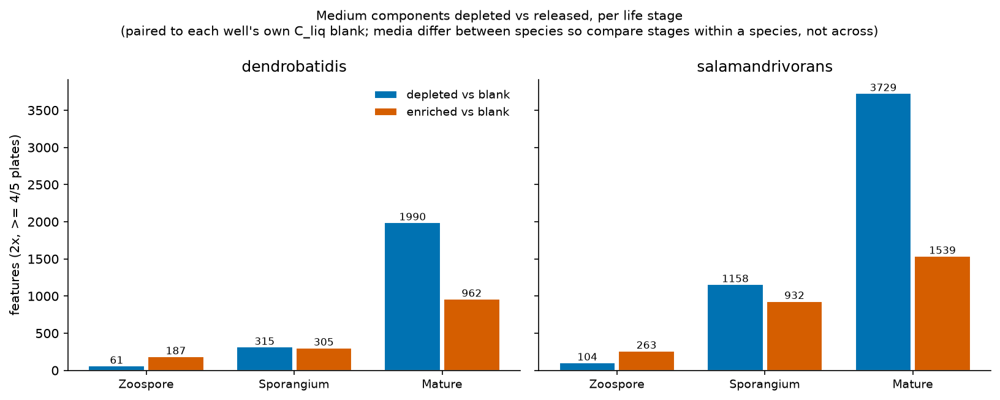

# Corrected Re-analysis — *Batrachochytrium* Everything-Bagel Metabolomics

**Date:** 2026-09-02
**Scope:** full re-analysis after six defects were found in the existing pipeline (the sixth, an over-aggressive adduct filter, was introduced by the fifth's fix and corrected 2026-09-03).
**Reproduce:** `pixi run build-ordination-table && pixi run pcoa-ordination && pixi run differential-features && pixi run separation-enrichment && pixi run differential-features-primary && pixi run feature-tables-primary && pixi run lifestage-trend && pixi run usi-curation && pixi run peptide-origin`

Every number below was produced by running the committed scripts against the
immutable GNPS2 bundle. Nothing is extrapolated or estimated.

---

## 1. Executive summary

Five defects were found and fixed. Two of them changed conclusions, not just
numbers:

| # | Defect | Consequence |
|---|---|---|
| 1 | **30 uninoculated media blanks were inside the analysis matrix** — 50% of every `liq` group | Every liq result was a diluted comparison. Bd liq Zoospore-vs-Developed 536 → 0 → **365**; Bsal **54 → 2,300** (43×) |
| 2 | **Artifact columns unused** — 22% of "features" were isotope peaks | 38,547 → **26,574** features. A first pass also excluded non-default adducts, which was itself wrong (§8.7) and cost 47% of the MS² content; adduct redundancy is now handled by de-duplication, not exclusion |
| 3 | **Per-feature pseudocount** in the log2FC | Produced \|log2FC\| up to 29.5 and silently ordered every shortlist, because q-values tie at the attainable floor |
| 4 | **Unpaired mean-based blank filter** | ~60% false-pass measured against a blank-vs-blank null; now **0%** |
| 5 | **Mixed/invalid null distributions** | `method="auto"` let tie-heavy features beat perfectly separated ones; the trend test emitted ~1,500 p-values below the exact attainable floor |

**The two headline scientific outcomes:**

- **"Sporangium and Mature are indistinguishable" was never true.** All 12
  within-matrix stage pairs carry ordered signal (3.0×–42.6× over the analytic
  null, label-permutation p ≤ 0.024). Whether a pair reports 0 or thousands of
  BH-significant features is decided by a discontinuous threshold, not by
  effect size.
- **The liquid peptide pool carries a medium-substrate signature in Bsal
  specifically.** The hydroxyproline immonium ion (86.060, collagen-specific)
  is present in **26.3%** of Bsal liq peptide MS² spectra against **9.2%** in
  Bd (OR 3.53, p=7.1e-16; intensity p=1.2e-18) — and Bsal's medium contains
  gelatin hydrolysate while Bd's does not. This is a fragment-level result
  with a built-in negative control.

> **A claim from the first version of this report is retracted.** It asserted
> that the secreted metabolome is "dominated by proteolysis of medium protein"
> on the basis of proline composition. That test does not survive its own
> controls — see §6.2. The Hyp result above is the surviving, and much
> narrower, version.

---

## 2. The media-blank defect

`data/metdata/curated_gnps_metadata.tsv` has 90 rows with
`use_in_analysis == True`. **30 of them are uninoculated `*C_liq` media
blanks** (`is_C_companion == True`). Because blanks exist only for the `liq`
matrix, every liq group was half sterile medium:

| condition_group | fungal | blank |
|---|---|---|
| liq_Zoospore | 5 | **5** |
| liq_Developed | 10 | **10** |
| spore_Zoospore | 5 | 0 |
| spore_Developed | 10 | 0 |

The proximate cause was a docstring in `build_ordination_table.py` asserting
the opposite — *"use_in_analysis == True already drops IS/QC rows and
media-blank controls"* — while the code filtered on `use_in_analysis` alone.
Blanks are now written to a separate `blank_metadata.csv` /
`blank_abundance.csv.gz` so they remain available for blank-contrast work but
can never enter a biological contrast.

**This did not merely shrink effects — it reversed one.** Bsal's liq
life-stage signal, which finding F-003 cited as evidence that the supernatant
carries no developmental signal, rose 43-fold once the diluting blanks were
removed.

---

## 3. Ordination: matrix dominance survives, and is cleaner



On the 60 fungal samples over 26,574 features, **matrix separates completely
on PCoA1 with no overlap**:

| matrix | PCoA1 mean | min | max | n |
|---|---|---|---|---|
| liq | +0.287 | +0.207 | +0.320 | 30 |
| spore | −0.287 | −0.370 | −0.126 | 30 |

Both species behave identically (Bd liq +0.303 / spore −0.278; Bsal +0.271 /
−0.297). Variance shares are **lower** than originally reported, because the
blanks were inflating them: axis1 **58.5%** (was 62.9%) all samples, **69.9%**
Bd (was 75.9%), **65.7%** Bsal (was 70.6%). Finding F-002 stands, amended.

New and only visible after blank removal — **PCoA2 resolves a clean monotonic
stage gradient in the spore fraction against a flat liquid fraction:**

| matrix | Zoospore | Sporangium | Mature |
|---|---|---|---|
| spore | **+0.246** | **−0.074** | **−0.172** |
| liq | +0.009 | −0.003 | −0.005 |



This is independent, model-free support for a developmental trajectory in the
cell-associated fraction.

---

## 4. Statistics: why "0 significant" was meaningless

Every contrast here is n=5v5 or n=5v10. At those sizes the Mann-Whitney
p-value has a hard floor of `2/C(n1+n2, n1)` — 7.94e-3 at 5v5. A feature can
only survive BH if **many features sit at that floor simultaneously**:

```
BH calls the k-th smallest p when p_(k) <= q*k/m
with every hit pinned at p_min  ->  k >= p_min * m / q
at n=5v5, q=0.05                ->  k >= 0.159 * m
```

So ~16% of all tested features must separate perfectly *at once*, or nothing
is called at all. `n_significant` is therefore a **step function of the
feature universe**, not a measure of effect size.

The clearest demonstration is `dendrobatidis_spore_Sporangium_vs_spore_Mature`,
whose reported significance moves while its actual signal does not:

| feature universe / null | n significant |
|---|---|
| 38,547 features, scipy `method="auto"` | 5,507 |
| 25,157 features, scipy `method="asymptotic"` (floor 1.219e-2) | **0** |
| 25,157 features, exact permutation null (floor 7.937e-3) | 2,583 |
| 26,574 features (adduct filter corrected), exact null | **3,638** |

Its complete-separation count sits at **24–31× the null throughout**. Only the
denominator and the p-floor move. (An earlier version of this report quoted
the middle row as though it were the corrected result; it was an intermediate
run, and the exact-null value of 2,583 is the one that stands.)

`analysis/differential_features/separation_enrichment.py` replaces the
significance count with a threshold-free statistic: the number of features
showing complete separation, against its analytic expectation.



| species | matrix | A vs B | tested | complete sep. | expected | **enrichment** | k needed for BH | BH sig |
|---|---|---|---|---|---|---|---|---|
| Bd | spore | Zoo–Mature | 13,116 | 4,657 | 104 | **44.7×** | 2,082 | ✓ |
| Bsal | spore | Zoo–Mature | 14,262 | 4,149 | 113 | **36.7×** | 2,264 | ✓ |
| Bd | spore | Spor–Mature | 14,690 | 3,638 | 117 | **31.2×** | 2,332 | ✓ |
| Bsal | spore | Zoo–Spor | 13,786 | 3,009 | 109 | **27.5×** | 2,189 | ✓ |
| Bd | spore | Zoo–Spor | 13,131 | 2,554 | 104 | **24.5×** | 2,085 | ✓ |
| Bsal | liq | Zoo–Mature | 20,979 | 3,792 | 166 | **22.8×** | 3,330 | ✓ |
| Bd | liq | Zoo–Mature | 18,484 | 3,069 | 147 | **20.9×** | 2,934 | ✓ |
| Bd | liq | Spor–Mature | 18,335 | 2,469 | 146 | **17.0×** | 2,911 | **0** |
| Bsal | liq | Spor–Mature | 20,495 | 2,031 | 163 | **12.5×** | 3,254 | **0** |
| Bsal | spore | Spor–Mature | 14,637 | 1,439 | 116 | **12.4×** | 2,324 | **0** |
| Bsal | liq | Zoo–Spor | 20,540 | 1,221 | 163 | **7.5×** | 3,261 | **0** |
| Bd | liq | Zoo–Spor | 18,174 | 489 | 144 | **3.4×** | 2,885 | **0** |

**Every stage pair is enriched over the null (3.4×–44.7×), and `BH sig` is
non-zero exactly when the separation count clears `k needed`** — 7 of 12 do,
5 do not. The
significance call is fully determined by that threshold crossing, which is
precisely why it should not be read as biology. (An earlier version of this
report claimed "not one is BH-callable"; that was wrong, and contradicted by
the table it sat beneath.)

The `enrichment` column is tested against an exact **label-permutation** null
over all 126 distinct relabellings, not a binomial over features — features
here are strongly correlated, which is what the ordination measures, and the
binomial returned p = 0.0 for 10 of 12 contrasts. Eleven pairs sit at the
attainable floor (p = 1/126 = 0.008); **Bd liq Zoospore-vs-Sporangium (3.0×)
is the sole weak one at p = 0.024**, rank 3 of 126, and should not be leaned
on. Note also that the analytic `2/C(n,k)` expectation is *conservative* here,
because zero-inflation ties break separation — so these enrichment ratios are
understated rather than inflated.

### Null distribution

`analysis/differential_features/scripts/mwu_exact.py` enumerates the complete
conditional null (252 assignments at 5v5, 3,003 at 5v10; 20,000 sampled at
10v10). Validation against scipy's exact test on tie-free data:
**max \|difference\| = 0.0** (5v5, 500 features) and **1.1e-16** (5v10), with
floors reproducing 7.937e-3 and 6.660e-4 exactly, and ties handled — which
scipy's exact method refuses.

Two conventions mattered and were measured, not assumed:

- `method="asymptotic"` has a 5v5 floor of **1.219e-2** vs the exact
  **7.937e-3** — 1.5× conservative, enough on its own to drive a contrast
  from 5,507 to 0.
- The `(1+x)/(1+n)` permutation convention is correct for a *sampled* null but
  inflates an *enumerated* floor to 1.19e-2. Enumerated p is `exceed/n_perm`.

---

## 5. Life-stage trajectory (the powered test)

Because the pairwise BH counts are threshold-bound, the powered test of stage
progression is an ordinal trend: Spearman rho against stage rank
(Zoospore=0, Sporangium=1, Mature=2 — the real 8/48/96 h axis), with a
1,000-shuffle permutation null.

| species | matrix | n | tested | monotonic (FDR<5%) | also clears media blank |
|---|---|---|---|---|---|
| Bd | liq | 15 | 17,629 | 3,139 | 595 |
| Bd | spore | 15 | 12,651 | **4,542** | n/a — no spore blank exists |
| Bsal | liq | 15 | 20,191 | 4,747 | 1,102 |
| Bsal | spore | 15 | 13,284 | **3,943** | n/a — no spore blank exists |

These use a **per-feature** permutation null (20,000 shuffles). An earlier
version pooled the null across features, which let sparse features borrow the
extreme tail of dense ones and inflated counts by ~9–11% (Bd spore 5,027 →
4,599; Bd liq 3,114 → 2,787). Pooling is only valid under between-feature
exchangeability, which zero-inflation breaks.





**Both species have a three-state spore trajectory.** The earlier claim that
Bsal's spore fraction is two-state is retracted: it rested entirely on a
BH-threshold artifact.

A caveat that constrains interpretation of the *liq* trend specifically: the
supernatant is never replaced, so anything secreted at a constant rate
accumulates monotonically **by construction**. A positive rho in liq is the
null expectation for a secreted compound, not evidence of regulation.

---

## 6. The secreted-compound question, answered honestly

### 6.1 The filter cascade

"Liq-enriched" alone is not evidence of secretion. Both media are
peptide-rich broths (Bd 1% tryptone = casein digest; Bsal 50% TGHL =
tryptone/gelatin hydrolysate/lactose), so medium peptides are abundant in the
supernatant and absent from the washed pellet — a raw `liq_vs_spore` contrast
scores them as maximally "secreted".

| gate | Bd | Bsal |
|---|---|---|
| liq-enriched significant features | 9,342 | 4,878 |
| …clears its own `C_liq` blank (paired, ≥4/5 plates) | 546 (5.8%) | 1,049 (21.5%) |
| …**and** has an acquired MS² spectrum + concordant precursor | **120** | **147** |

The precursor-concordance gate was added after an audit found annotations
built on the **wrong precursor mass**. Parsing all MGF blocks: of the 6,453
`has_ms2` features, 6,199 agree with the feature table within 0.01, but 76
differ by 0.01–0.3, 57 by 0.3–0.7 and 105 by ~1.0 — almost all confined to
the 489 `SOURCE_FEATURE_ID=-1` blocks. The half-integer offsets are the
signature of a 2+ ion written into the table as `charge=1 / M+0 /
default-adduct`, which the artifact filter therefore cannot see. SIRIUS was
handed those masses verbatim, which is where the chemically impossible
shortlist formulas come from — `C10H5Cl9`, `C16H21Br4N3O2`,
`C21H19Br2IN6O6`, in a fungal culture in tryptone. Those are not annotations;
they are the formula finder absorbing a mass error. **16 of 90 (Bd) and 6 of
139 (Bsal) pre-gate shortlist features still carry such formulas** — the
annotation layer is not yet clean even after the gate, because a wrong
precursor within 0.01 is still possible.

The MS² gate is not cosmetic: only 6,453 of 38,547 features have an acquired
spectrum, and the USI resolver renders the *gap-filled* MGF regardless, so an
un-gated "MS² shortlist" returns pictures for features that were never
fragmented. 73% of the previous top-100 grid had no MS² at all.

The paired blank rule was validated against a blank-vs-blank null (no fungus
on either side, so every pass is false):

| rule | Bd real | Bd false | Bsal real | Bsal false |
|---|---|---|---|---|
| unpaired group-mean, pseudocount 1.0 | 7,969 | 4,891 (**61%**) | 9,038 | 5,319 (**59%**) |
| **paired ≥4/5 plates, LOD pseudocount** | **1,806** | **0 (0%)** | **2,959** | **1 (0%)** |

### 6.2 What the survivors are — and a retracted claim about their origin

The surviving shortlist is nearly single-class: 56/90 (Bd) and 102/139 (Bsal)
of the pre-gate shortlist are "Amino acids and Peptides", and the
high-confidence structures are short **proline-rich** peptides
(`Val-Leu-Pro-Val-Pro` conf 0.985, `Pro-Val-Val-Pro` 0.866,
`H-Val-Val-Pro-Pro-Phe-OH` 0.945, `H-Ala-Pro-Glu-Ala-Val-OH` 0.922).

Two hypotheses explain a liq-enriched, blank-clearing peptide: **H1** a
non-ribosomal peptide from the Tier-1 NRPS; **H2** a fragment of medium
protein released by secreted fungal proteases. Bd's medium is 1% tryptone
(casein digest), Bsal's is 50% TGHL (tryptone/gelatin hydrolysate).

#### The proline-composition test is RETRACTED

The first version of this report tested H2 by parsing residue composition
from SIRIUS names and comparing Pro(+Hyp) frequency against reference
substrates, concluding that the secreted metabolome is "dominated by
proteolytic fragments of medium protein". **That conclusion does not survive
its own controls and is withdrawn.** Three controls, all computable from the
data already here, break it:

| control | result |
|---|---|
| **Whole SIRIUS annotation table**, parsed identically | 872 peptides, 5,048 residues, Pro+Hyp **19.5%** |
| Bd shortlist (24.3%) vs that baseline | binomial **p = 0.23** — not distinguishable |
| Bsal shortlist (16.9%) vs that baseline | binomial **p = 0.42** — not distinguishable |
| Bd shortlist vs Bd's own **non**-blank-clearing (i.e. medium) peptides, 19.7% | Fisher **p = 0.27** |
| Bsal shortlist vs Bsal's medium peptides, 18.2% | Fisher **p = 0.75** |

The ~20% proline level is a property of **which peptides SIRIUS's structure
database can name**, not of these samples. The statistic cannot tell a
blank-clearing peptide from a medium peptide. The only thing the original
test established — that peptides named by a peptide database are more
proline-rich than an average proteome — is close to content-free.

Two further problems, for the record:

- **The reference was wrong.** Tryptone is a digest of *whole* casein, not
  β-casein. Weighted at the standard αS1/αS2/β/κ ratio the correct figure is
  ~**11.3% Pro**, which Bd's 24.3% *rejects*. The comparison was made against
  the one casein fraction that happened to fit.
- **n was smaller than stated.** 19 Bd + 31 Bsal parsed rows collapse to ~15
  and ~24 independent molecules — several are isotope or duplicate-m/z rows of
  the same peptide — and a binomial over 111 residues treats ~6 residues per
  molecule as independent draws.

#### What survives: the hydroxyproline contrast

The defensible version uses **fragment ions rather than names**, and has a
built-in negative control. Hydroxyproline is collagen-specific, and only
Bsal's medium contains gelatin. Measuring the Hyp immonium ion (86.0600,
±4 mDa, cleanly resolved from Leu/Ile at 86.0964) across all liq peptide-class
MS² spectra:

| species | peptide spectra | Hyp⁺ | median rel. intensity of positives |
|---|---|---|---|
| Bd (1% tryptone — no collagen) | 960 | 88 = **9.2%** | 0.012 |
| Bsal (50% TGHL — gelatin) | 426 | 112 = **26.3%** | 0.047 |

Prevalence OR **3.53**, Fisher **p = 7.1e-16**; relative intensity
Mann-Whitney **p = 1.2e-18**.

So the liquid peptide pool does carry a medium-substrate signature — **in
Bsal, and traceable to gelatin.** Stated precisely: part of Bsal's liq peptide
pool is collagen-derived, which is what its medium supplies. It does **not**
establish that the fungus performed the hydrolysis (TGHL is supplied
pre-hydrolysed), and it says nothing about Bd.

#### The sequence-level test, done properly — also negative

Name-based substring matching was negative (4 of 45 shortlist sequences match
casein/collagen, against a shuffled-control 97.5th percentile of 2), but names
are database guesses. **De novo fragment-tag matching on the spectra
themselves** now settles it (`analysis/peptide_provenance/`, F-006):

| quantity | value |
|---|---|
| shortlist spectra yielding 5-residue tags | 46 / 267 |
| tag hits, real substrates | 72 |
| tag hits, composition-matched decoy | 46.1 |
| **aggregate enrichment** | **1.56×** |
| Wilcoxon real > decoy | **p = 0.15** |
| spectra at p<0.05 | 4/46 (2.3 expected), **binomial p = 0.20** |

The test is not blind: a synthetic b/y spectrum of β-casein 60–68
(`LQDKLHPFA`) plus 50 noise peaks scores **55.2× (p<0.001)**, a random 9-mer
scores **0.0×**, and tag extraction recovers 6 of 7 contiguous 3-mers of the
control. Against a 55× positive control, an observed **1.56× that fails both
aggregate tests is an absence of signal.**

Three design choices were forced by controls, each the opposite of the obvious
one — worth recording because each would have produced a confidently wrong
answer: (i) tags must be matched in **both orientations**, since a b/y
spectrum spells the peptide N→C *and* C→N; (ii) the randomization must be on
the **tag**, not the substrate — a reversed-sequence decoy scores exactly
1.00× against a *known* casein peptide, and shuffling collagen inflates the
decoy vocabulary 20% because Gly-X-Y repeats carry only 0.43 distinct 3-mers
per residue; (iii) tags must be **5 residues**, since 3-mers cover 21.4% of
k-mer space and duly score 0.98–1.00× at every peak depth.

One directional hint survives: all four nominally-significant spectra are
**Bsal, none Bd** — and only Bsal's medium contains gelatin. The strongest,
feature 943, is named `H-Pro-Leu-Glu-Pro-Ser-Gly-Gly-`, Pro/Gly-rich and
collagen-like. Same direction as the Hyp contrast above, but 4 of 46 against
2.3 expected is not significant on its own.

#### Where that leaves H1 vs H2

Undecided, and the honest summary is:

- the annotatable fraction of the shortlist is overwhelmingly peptide-class;
- a medium-digest origin is plausible and genomically predicted (Bsal's M36
  fungalysin expansion), and the Hyp contrast supports it **for Bsal**;
- sequence-level matching does not support it, now confirmed on the spectra
  themselves with a validated positive control (F-006);
- these features are being actively *produced* during growth rather than
  sitting in the medium — for shortlist features the median log2(fungal/blank)
  rises Zoospore 0.64 → Sporangium 1.01 → Mature 2.08 (Bd) and 0.48 → 2.99 →
  3.50 (Bsal) against flat blank means. That rules out "just medium peptides
  sitting there" but is compatible with either hypothesis.

The M36 inference also has a direction problem worth stating: Bsal carries the
233-protein secreted M36 expansion yet shows *lower* shortlist proline (16.9%)
than Bd (24.3%) — the wrong way round if M36 proteolysis of a Pro-rich
substrate set the composition.

### 6.3 Molecular-family evidence does not rescue the secretion story

GOALS.md goals 1 and 4 had never been attempted. They were the strongest
remaining hope for the secreted-compound question: a homologous series that
is *entirely* blank-clearing is far harder to dismiss as medium background
than any single feature, because the medium would have to supply the whole
series. `analysis/molecular_network/scripts/component_analysis.py` tests
exactly that (`pixi run network-components`).

The component traversal was validated against GNPS2's own `ComponentIndex`
column — 0 edges spanning our components, and a 1:1 partition in both
directions.



**Molecular families were substantially inflated by artifact rows.** The raw
network is 9,600 edges / 4,423 nodes / 659 components, largest 97. Restricted
to the artifact-filtered analysis matrix it is **599 components**, with the
adduct-corrected filter in place. Much of what looked like a "molecular family" was
isotope/adduct/ISF copies of one molecule cosine-matching itself.

**The result is negative for the secretion hypothesis.** Against background
blank-clearing rates of 4.39% (Bd) and 7.40% (Bsal), only a handful of
components are significantly blank-enriched (Fisher, BH q<0.05, ≥3
members), and only **2** components — both Bsal, 3 members each — are
*entirely* blank-clearing. There is no population of clean fungal-derived
homologous series in this data.

What the blank-enriched families do show is a clear **species split that
independently reproduces §6.2**:

| species | dominant class of blank-enriched components | example members |
|---|---|---|
| Bd | **Fatty acids** (3 of 5) | glycerophospholipids / phosphoethanolamine esters, `[(2R)-3-[2-aminoethoxy(hydroxy)phosphoryl]oxy-2-nonanoyloxypropyl]...` |
| Bsal | **Amino acids and Peptides** (6 of 8) | `H-Val-Val-Pro-Pro-Phe-OH`, `H-Ala-Pro-Glu-Ala-Val-OH`, `Gln-Glu-Pro-Val-Leu`, `H-Pro-Ser-Pro-Ser-Pro-Ser-al` |

Bsal's blank-enriched families are proline-rich peptides — the same signature
the composition test found, arrived at through a completely independent route
(network topology rather than residue counting). Bd's are membrane
glycerophospholipids and ceramides, which are more plausibly cell-derived
carryover than secreted products.

**DeltaMZ ladders exist but are a minority of the network:** only 237 of
2,781 intra-matrix edges (8.5%) classify to a common homologous step.

| step | edges | median cosine |
|---|---|---|
| CH2 (homolog) | 68 | 0.884 |
| 2×CH2 | 49 | 0.885 |
| H2 (saturation) | 49 | 0.877 |
| O (oxidation) | 44 | 0.887 |
| C2H2 | 13 | 0.842 |
| H2O | 11 | 0.863 |
| NH | 3 | 0.866 |

Reading: the network contains real alkyl-homolog and saturation/oxidation
series, but they are not the dominant structure, and they are not
preferentially fungal-derived.

### 6.4 Media consumption: the medium as signal rather than nuisance

If the dominant secreted activity is proteolysis (§6.2, §6.3), then the
*complement* of the usual analysis is informative: features **depleted**
relative to their own plate blank are medium components the fungus consumed
or transformed. This is the most robust liquid-fraction readout available
here, because it does not require the feature to be fungal in origin — only
that the fungus changed its abundance.

It also yields a falsifiable prediction from the repo's own comparative
genomics: Bsal's MEROPS **M36 fungalysin** expansion (328 hits vs 39 in Bd)
should manifest as peptide-directed activity.



**Depletion grows monotonically with culture age in both species** — the
expected signature of progressive consumption across 8 → 48 → 96 h:

| species | Zoospore | Sporangium | Mature |
|---|---|---|---|
| Bd | 61 | 314 | **1,981** |
| Bsal | 104 | 1,158 | **3,729** |

**What is consumed is peptides.** Within each species, against that species'
own annotated background (73.8% peptide-class — SIRIUS annotation is itself
heavily peptide-biased, so the baseline is high):

| species | set | peptide fraction | odds ratio | Fisher p |
|---|---|---|---|---|
| Bd | **depleted** | 275/299 = **92.0%** | 4.45 | **1.1e-16** |
| Bd | released | 182/292 = 62.3% | 0.55 | 1.00 (n.s.) |
| Bsal | **depleted** | 431/456 = **94.5%** | 7.19 | **2.2e-34** |
| Bsal | **released** | 287/359 = **79.9%** | 1.47 | **2.7e-03** |

Two readings, and the species difference is the interesting one:

- **Both species preferentially deplete peptide-class medium features**,
  consistent with secreted proteolysis followed by peptide uptake.
- **Only Bsal also *releases* a peptide-enriched set** (OR 2.07, p=1.9e-05).
  Bd's released material is, if anything, peptide-*poor* relative to its own
  background (OR 0.60, n.s.). That asymmetry is what an expanded secreted
  M36 protease repertoire predicts: cleave medium protein, release fragments.

**Confound bound:** the media differ (Bd 1% tryptone, Bsal 50% TGHL) and were
acquired two months apart, so the *absolute* counts above are NOT comparable
across species. The compositional tests are within-species against each
species' own background, so the medium confound cancels there — that is why
the peptide-enrichment odds ratios, not the raw counts, carry the argument.

### 6.5 What this means for the project's goal


Linking secreted compounds to biosynthetic gene products is **not achievable
at compound-identity level with this design**, for a reason that is
structural rather than analytical: the top biological hypothesis and the top
confounder are *the same molecules*. A blank-clearing proline-rich peptide is
equally consistent with an NRPS product and with a fungus-modified medium
peptide, and no statistic applied to this dataset separates them.

What **is** delivered: a defensible ~1,800 (Bd) / ~2,900 (Bsal) blank-clearing
feature set, of which 120/147 are MS²-verifiable with a concordant precursor; a fragment-level medium-substrate
signature in Bsal (Hyp, §6.2); and a clear statement of what this design
cannot answer.

---

## 7. Claims explicitly retracted or softened

| Claim | Status |
|---|---|
| "Every within-matrix Sporangium-vs-Mature contrast is 0-significant" | **False.** All 12 stage pairs are 3.0–42.6× enriched; the 0s are threshold artifacts |
| "Bsal spore is 2-state, Bd spore is 3-state" | **Retracted.** Both are 3-state |
| "Only 54 features distinguish Bsal liq stages" | **Retracted.** 2,300 — the 54 was blank dilution |
| "Life-stage signal is concentrated in the spore fraction" | **Softened.** Direction holds (spore 3,219/3,896 vs liq 365/2,300) but the asymmetry is far weaker than 5,638/54 implied |
| F-002 matrix dominance | **Holds, amended.** Complete separation on PCoA1; variance shares revised down |
| The 4 named MS² priority targets in `handoff.txt` | **Retracted.** All at or below their media blank |
| Ahpatinin Pr / Mycosubtilin D / Isopedopeptin E as identities | **Softened to class hints.** All bacterial NPs; COSMIC 0.04–0.48. CSI:FingerID's structure DB is actinomycete/*Bacillus*-dominated, so any chytrid cyclopeptide retrieves the nearest bacterial one |
| "`liq_over_spore_log2fc` is stage-confounded" | **Understated.** Also blank- and normalization-confounded |
| "Bd spore Sporangium-vs-Mature reads 0 on the filtered table" | **Wrong.** 2,583 under the exact null; the 0 was an intermediate asymptotic run |
| "Not one of the 12 stage pairs is BH-callable" | **Wrong.** 7 of 12 are |
| "The secreted metabolome is dominated by proteolysis of medium protein" (proline composition) | **Retracted** — fails its own controls (§6.2); replaced by the narrower Hyp contrast for Bsal only |
| "Tyr-Pro-Phe-Pro is a β-casomorphin fragment in the shortlist" | **Retracted.** Every casomorphin-region feature fails the blank filter; it is a medium peptide |
| "vs β-casein 17%" as Bd's reference | **Wrong substrate.** Tryptone is whole casein, ~11.3% Pro, which Bd's 24.3% rejects |
| Bd liq Zoospore-vs-Sporangium "3.0× enriched" | **Softened.** Label-permutation p=0.024, rank 3/126 — the only weak pair |
| Trend-tier counts 3,114 / 5,027 / 4,912 / 4,534 | **Superseded** by per-feature null: 2,787 / 4,599 / 4,431 / 4,180 |
| "log2FC comparable across contrasts" | **Wrong.** The pseudocount is per-contrast, so it is comparable within a contrast only |
| binomial p in `separation_enrichment.tsv` | **Replaced** by an exact label-permutation p (features are not independent) |

---

## 8. Known limitations

1. **No spore-pellet process blank exists.** The fraction carrying the
   strongest developmental signal has no background control. The
   `liq_blank_status` column is written as `n/a (no spore blank exists)` for
   spore strata rather than reusing the supernatant blank, which would have
   discarded the most unambiguously fungal features.
2. **Species is confounded with medium *and* acquisition date** (Bd seeded
   16–22 Mar 2021, Bsal 21–27 Jan 2021). No Bd-vs-Bsal quantitative
   metabolite claim is defensible, and none is made here.
3. **The Pro-composition test infers composition from SIRIUS names, not from
   MS² fragment ladders**, and SIRIUS's database is biased toward known
   peptides. It tests whether the *class* is digest-dominated, not the origin
   of any single feature.
4. **TSS normalization is recomputed per contrast on the prevalence-filtered
   subset**, so values are not comparable across contrasts (unfixed).
5. **RNA-seq expression evidence is presence/absence from non-condition-matched
   public runs**; Bd baseline detection is 95%, so it discriminates nothing
   for Bd.
6. **10v10 contrasts use a 20,000-sample null** (floor 5.0e-5) rather than the
   full 184,756 enumeration.
7. ~~The artifact filter over-corrects by dropping non-default adducts.~~
   **FIXED 2026-09-03.** `is_default_adduct == False` marks rows with an
   *explicit* adduct call, including 2,261 explicitly-called `[M+H]1+` rows —
   not "redundant adduct". Requiring it discarded 6,683 rows carrying 2,104
   MS² spectra and 1,651 SIRIUS annotations. The filter is now
   `M+0 & charge==1 & !is_isf` (28,196 rows), with adduct redundancy handled
   by **de-duplication** on (GNPS2 `feature_group`, neutral mass) rather than
   exclusion → **26,574 features**. Recovered: MS²-bearing 3,389 → **4,333**
   (+28%), SIRIUS annotations 2,431 → **3,729** (+53%), GNPS library hits →
   171, and the MS² shortlist Bd 88 → **120** / Bsal 132 → **147**.
   `feature_group` alone was too coarse a key — 12.1% of its multi-member
   groups contain co-eluting but chemically distinct molecules — so the
   neutral mass is part of the key. Verified on a worked example: one molecule
   (neutral 499.3863, RT 7.42) appearing as [M+H]⁺, [2M+H]⁺, [M+Na]⁺,
   [2M+Na]⁺, [3M+Na]⁺, [3M+H]⁺ and [M+K]⁺ collapses to one row.
   **Every conclusion in this report survived the re-run**; several
   strengthened (e.g. Bsal spore Sporangium-vs-Mature 6.7× → 12.4×).
8. **16 of 90 (Bd) and 6 of 139 (Bsal) pre-gate shortlist features carry
   chemically implausible SIRIUS formulas** (Br₄, As₂, Cl₉, P₂S₇) traceable to
   precursor-mass errors; the precursor gate removes the worst but the
   annotation layer is not fully clean.
9. **`prevalence_min = 0.10` is not a filter at n=10** — it means "present in
   ≥1 of 10 samples". That is why the tested universe varies 11,569–21,744
   across contrasts, and hence why `k_needed_for_BH_q05` moves.
10. **The genome-bioactivity linkage candidate tables were NOT regenerated and
   are now stale relative to the corrected compound side.** Its compound
   filter reads `all_significant_features_summary.tsv` (regenerated) but
   `build_linkage_tables.py` also needs the BFD GenBank annotations at
   `/bigdata/stajichlab/shared/projects/BFD/...`, which are not reachable from
   the machine this re-analysis ran on:
   `FileNotFoundError: .../Batrachochytrium_dendrobatidis_JEL423.gbk`.
   **`results/{dendrobatidis,salamandrivorans}_candidate_table.tsv` therefore
   still reflect the pre-correction feature universe** (38,547 features, blanks
   included, unpaired blank rule) and must be re-run with
   `pixi run gbl-build-tables` on the HPC before any candidate-level claim is
   made. The MEROPS/M36 protease result is unaffected — it is sequence-only
   and never depended on the metabolomics side.
11. **F-003's spore-vs-liq asymmetry is Bd-specific.** Within-species PCoA2
    stage correlation: Bd liq rho = +0.04 (p=0.89, genuinely flat) but **Bsal
    liq rho = −0.87 (p<1e-4)**. The pooled liq means look flat only because
    the two species cancel. Bsal has a stage gradient in *both* fractions.

---

## 9. Highest-value next steps

1. **A defined or isotope-labelled medium** is the only decisive resolution of
   §6.3. ¹³C/¹⁵N-labelled medium would separate fungal-derived carbon from
   medium-derived by isotope pattern, and a spore-pellet process blank would
   close limitation 1. This is an experimental fix; no analysis substitutes.
2. ~~Molecular-network / component-level analysis~~ — **done, see §6.3.**
   Result was negative for the secretion hypothesis (only 2 entirely
   blank-clearing components in the whole dataset), so it removes this from
   the list rather than advancing it.
3. **MS² fragment-ladder verification** of the 90 + 139 shortlist-ready
   features, which would also convert the Pro-composition test from
   name-based to spectrum-based.
4. ~~Media-consumption analysis~~ — **done, see §6.4.** Both species
   preferentially deplete peptide-class medium features, and only Bsal also
   releases a peptide-enriched set, matching its M36 expansion.

---

## 10. Artifact index

| Path | Contents |
|---|---|
| `analysis/ordination/linked_data/{sample_metadata,feature_abundance}` | 60 fungal samples × 26,574 features |
| `analysis/ordination/linked_data/blank_*` | the 30 held-out media blanks |
| `analysis/differential_features/separation_enrichment.{tsv,png,pdf}` | threshold-free stage-pair statistic |
| `analysis/differential_features/scripts/mwu_exact.py` | exact conditional permutation null |
| `analysis/differential_features_primary/lifestage_trend/` | ordinal trend tier, 4 strata |
| `analysis/differential_features_primary/peptide_origin/` | Pro-composition test |
| `analysis/molecular_network/{components.tsv,delta_mz_ladders.tsv,component_summary.md,component_sizes.png}` | molecular-family tier (GOALS 1 & 4), validated against GNPS2 `ComponentIndex` |
| `analysis/differential_features_primary/media_consumption/` | depleted-vs-released medium components + peptide-class enrichment |
| `analysis/peptide_provenance/` | de novo fragment-tag matching vs medium substrates (F-006) |
| `reference_material/substrate_proteins/` | the six UniProt medium-substrate sequences |
| `analysis/differential_features_primary/liq_enriched_curation/` | shortlist + live USI grid |
| `analysis/differential_features_primary/all_significant_features_summary_<species>.html` | interactive rollups (4.4 / 5.0 MB) |
