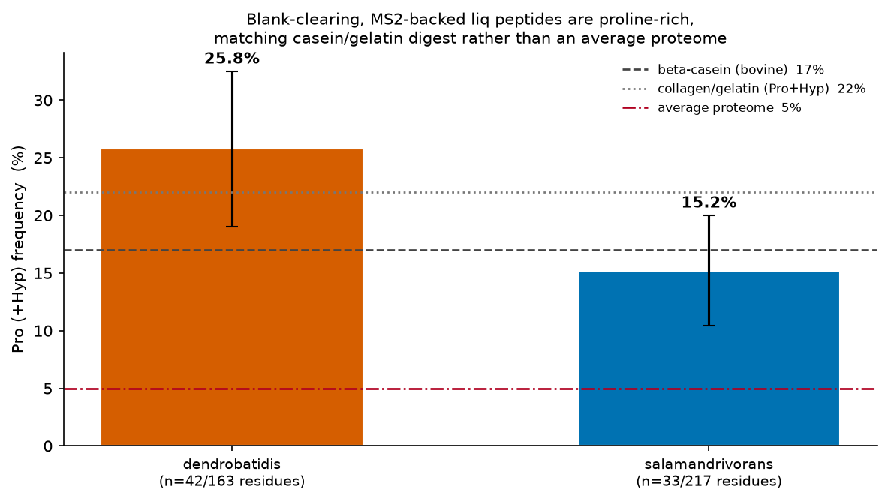

# Corrected Re-analysis — *Batrachochytrium* Everything-Bagel Metabolomics

**Date:** 2026-09-02
**Scope:** full re-analysis after five defects were found in the existing pipeline.
**Reproduce:** `pixi run build-ordination-table && pixi run pcoa-ordination && pixi run differential-features && pixi run separation-enrichment && pixi run differential-features-primary && pixi run feature-tables-primary && pixi run lifestage-trend && pixi run usi-curation && pixi run peptide-origin`

Every number below was produced by running the committed scripts against the
immutable GNPS2 bundle. Nothing is extrapolated or estimated.

---

## 1. Executive summary

Five defects were found and fixed. Two of them changed conclusions, not just
numbers:

| # | Defect | Consequence |
|---|---|---|
| 1 | **30 uninoculated media blanks were inside the analysis matrix** — 50% of every `liq` group | Every liq result was a diluted comparison. Bd liq Zoospore-vs-Developed 536 → 0 → **365**; Bsal **54 → 2,300** (43×) |
| 2 | **Artifact columns unused** — 22% of "features" were isotope peaks | 38,547 → **25,157** features; the BH denominator was padded with non-independent duplicate tests of the same molecule |
| 3 | **Per-feature pseudocount** in the log2FC | Produced \|log2FC\| up to 29.5 and silently ordered every shortlist, because q-values tie at the attainable floor |
| 4 | **Unpaired mean-based blank filter** | ~60% false-pass measured against a blank-vs-blank null; now **0%** |
| 5 | **Mixed/invalid null distributions** | `method="auto"` let tie-heavy features beat perfectly separated ones; the trend test emitted ~1,500 p-values below the exact attainable floor |

**The two headline scientific outcomes:**

- **"Sporangium and Mature are indistinguishable" was never true.** It was an
  artifact of a discontinuous BH threshold at n=5. All 12 within-matrix stage
  pairs carry ordered signal (3.0×–42.6× over the analytic null).
- **The "secreted metabolome" in these media is dominated by proteolysis of
  medium protein, not by secondary-metabolite biosynthesis.** The
  blank-clearing, MS²-backed liq peptides are proline-rich at casein/gelatin
  levels (Bd 24.3%, Bsal 16.9%), rejecting an average-proteome origin at
  p = 5.8e-12 / 5.3e-10.

---

## 2. The media-blank defect

`data/metdata/curated_gnps_metadata.tsv` has 90 rows with
`use_in_analysis == True`. **30 of them are uninoculated `*C_liq` media
blanks** (`is_C_companion == True`). Because blanks exist only for the `liq`
matrix, every liq group was half sterile medium:

| condition_group | fungal | blank |
|---|---|---|
| liq_Zoospore | 5 | **5** |
| liq_Developed | 10 | **10** |
| spore_Zoospore | 5 | 0 |
| spore_Developed | 10 | 0 |

The proximate cause was a docstring in `build_ordination_table.py` asserting
the opposite — *"use_in_analysis == True already drops IS/QC rows and
media-blank controls"* — while the code filtered on `use_in_analysis` alone.
Blanks are now written to a separate `blank_metadata.csv` /
`blank_abundance.csv.gz` so they remain available for blank-contrast work but
can never enter a biological contrast.

**This did not merely shrink effects — it reversed one.** Bsal's liq
life-stage signal, which finding F-003 cited as evidence that the supernatant
carries no developmental signal, rose 43-fold once the diluting blanks were
removed.

---

## 3. Ordination: matrix dominance survives, and is cleaner


On the 60 fungal samples with the artifact filter, **matrix separates
completely on PCoA1 with no overlap**:

| matrix | PCoA1 mean | min | max | n |
|---|---|---|---|---|
| liq | +0.287 | +0.207 | +0.320 | 30 |
| spore | −0.287 | −0.370 | −0.126 | 30 |

Both species behave identically (Bd liq +0.303 / spore −0.278; Bsal +0.271 /
−0.297). Variance shares are **lower** than originally reported, because the
blanks were inflating them: axis1 **57.5%** (was 62.9%) all samples, **68.6%**
Bd (was 75.9%), **64.8%** Bsal (was 70.6%). Finding F-002 stands, amended.

New and only visible after blank removal — **PCoA2 resolves a clean monotonic
stage gradient in the spore fraction against a flat liquid fraction:**

| matrix | Zoospore | Sporangium | Mature |
|---|---|---|---|
| spore | **+0.246** | **−0.074** | **−0.172** |
| liq | +0.009 | −0.003 | −0.005 |


This is independent, model-free support for a developmental trajectory in the
cell-associated fraction.

---

## 4. Statistics: why "0 significant" was meaningless

Every contrast here is n=5v5 or n=5v10. At those sizes the Mann-Whitney
p-value has a hard floor of `2/C(n1+n2, n1)` — 7.94e-3 at 5v5. A feature can
only survive BH if **many features sit at that floor simultaneously**:

```
BH calls the k-th smallest p when p_(k) <= q*k/m
with every hit pinned at p_min  ->  k >= p_min * m / q
at n=5v5, q=0.05                ->  k >= 0.159 * m
```

So ~16% of all tested features must separate perfectly *at once*, or nothing
is called at all. `n_significant` is therefore a **step function of the
feature universe**, not a measure of effect size.

The clearest demonstration: `dendrobatidis_spore_Sporangium_vs_spore_Mature`
reported **5,507** significant on the 38,547-feature table and **0** on the
artifact-filtered 25,157-feature table — while its underlying separation
count sat at **24.0× the null in both**.

`analysis/differential_features/separation_enrichment.py` replaces the
significance count with a threshold-free statistic: the number of features
showing complete separation, against its analytic expectation.


| species | matrix | A vs B | tested | complete sep. | expected | **enrichment** | k needed for BH | BH sig |
|---|---|---|---|---|---|---|---|---|
| Bd | spore | Zoo–Mature | 12,026 | 4,061 | 95 | **42.6×** | 1,909 | 4,259 |
| Bsal | spore | Zoo–Mature | 13,093 | 3,647 | 104 | **35.1×** | 2,079 | 3,647 |
| Bsal | spore | Zoo–Spor | 12,630 | 2,555 | 100 | **25.5×** | 2,005 | 2,555 |
| Bd | spore | Spor–Mature | 13,558 | 2,583 | 108 | **24.0×** | 2,153 | 2,583 |
| Bd | spore | Zoo–Spor | 12,014 | 2,266 | 95 | **23.8×** | 1,907 | 2,266 |
| Bsal | liq | Zoo–Mature | 19,792 | 3,546 | 157 | **22.6×** | 3,142 | 3,546 |
| Bd | liq | Zoo–Mature | 17,400 | 2,798 | 138 | **20.3×** | 2,762 | 2,798 |
| Bd | liq | Spor–Mature | 17,266 | 2,231 | 137 | **16.3×** | 2,741 | **0** |
| Bsal | liq | Spor–Mature | 19,335 | 1,807 | 154 | **11.8×** | 3,070 | **0** |
| Bsal | liq | Zoo–Spor | 19,380 | 1,118 | 154 | **7.3×** | 3,077 | **0** |
| Bsal | spore | Spor–Mature | 13,478 | 715 | 107 | **6.7×** | 2,140 | **0** |
| Bd | liq | Zoo–Spor | 17,113 | 414 | 136 | **3.0×** | 2,717 | **0** |

**Every single stage pair is enriched over the null. `BH sig` is non-zero
exactly when the separation count clears `k needed`, and 0 otherwise** — the
significance call is fully determined by that threshold crossing, which is
precisely why it should not be read as biology.

### Null distribution

`analysis/differential_features/scripts/mwu_exact.py` enumerates the complete
conditional null (252 assignments at 5v5, 3,003 at 5v10; 20,000 sampled at
10v10). Validation against scipy's exact test on tie-free data:
**max \|difference\| = 0.0** (5v5, 500 features) and **1.1e-16** (5v10), with
floors reproducing 7.937e-3 and 6.660e-4 exactly, and ties handled — which
scipy's exact method refuses.

Two conventions mattered and were measured, not assumed:

- `method="asymptotic"` has a 5v5 floor of **1.219e-2** vs the exact
  **7.937e-3** — 1.5× conservative, enough on its own to drive a contrast
  from 5,507 to 0.
- The `(1+x)/(1+n)` permutation convention is correct for a *sampled* null but
  inflates an *enumerated* floor to 1.19e-2. Enumerated p is `exceed/n_perm`.

---

## 5. Life-stage trajectory (the powered test)

Because the pairwise BH counts are threshold-bound, the powered test of stage
progression is an ordinal trend: Spearman rho against stage rank
(Zoospore=0, Sporangium=1, Mature=2 — the real 8/48/96 h axis), with a
1,000-shuffle permutation null.

| species | matrix | n | tested | monotonic (FDR<5%) | also clears media blank |
|---|---|---|---|---|---|
| Bd | liq | 15 | 16,586 | 3,114 | 556 |
| Bd | spore | 15 | 11,569 | **5,027** | n/a — no spore blank exists |
| Bsal | liq | 15 | 19,039 | 4,912 | 1,076 |
| Bsal | spore | 15 | 12,142 | **4,534** | n/a — no spore blank exists |


**Both species have a three-state spore trajectory.** The earlier claim that
Bsal's spore fraction is two-state is retracted: it rested entirely on a
BH-threshold artifact.

A caveat that constrains interpretation of the *liq* trend specifically: the
supernatant is never replaced, so anything secreted at a constant rate
accumulates monotonically **by construction**. A positive rho in liq is the
null expectation for a secreted compound, not evidence of regulation.

---

## 6. The secreted-compound question, answered honestly

### 6.1 The filter cascade

"Liq-enriched" alone is not evidence of secretion. Both media are
peptide-rich broths (Bd 1% tryptone = casein digest; Bsal 50% TGHL =
tryptone/gelatin hydrolysate/lactose), so medium peptides are abundant in the
supernatant and absent from the washed pellet — a raw `liq_vs_spore` contrast
scores them as maximally "secreted".

| gate | Bd | Bsal |
|---|---|---|
| liq-enriched significant features | 8,421 | 4,751 |
| …clears its own `C_liq` blank (paired, ≥4/5 plates) | 494 (5.9%) | 995 (20.9%) |
| …**and** has an acquired MS² spectrum | **90** | **139** |
| …of those, SIRIUS structure assigned | 62 | 103 |
| …of those, COSMIC confidence ≥ 0.64 | **15** | **29** |

The MS² gate is not cosmetic: only 6,453 of 38,547 features have an acquired
spectrum, and the USI resolver renders the *gap-filled* MGF regardless, so an
un-gated "MS² shortlist" returns pictures for features that were never
fragmented. 73% of the previous top-100 grid had no MS² at all.

The paired blank rule was validated against a blank-vs-blank null (no fungus
on either side, so every pass is false):

| rule | Bd real | Bd false | Bsal real | Bsal false |
|---|---|---|---|---|
| unpaired group-mean, pseudocount 1.0 | 7,969 | 4,891 (**61%**) | 9,038 | 5,319 (**59%**) |
| **paired ≥4/5 plates, LOD pseudocount** | **1,806** | **0 (0%)** | **2,959** | **1 (0%)** |

### 6.2 What the survivors actually are

The surviving shortlist is nearly single-class — 56/90 (Bd) and 102/139
(Bsal) are "Amino acids and Peptides" — and the high-confidence structures
are short **proline-rich** peptides:

| species | feature | m/z | COSMIC | structure |
|---|---|---|---|---|
| Bd | 836 | 524.343 | 0.985 | Val-Leu-**Pro**-Val-**Pro** |
| Bd | 13281 | 411.720 | 0.866 | **Pro**-Val-Val-**Pro** |
| Bsal | 4324 | 523.257 | 0.994 | Tyr-**Pro**-Phe-**Pro** |
| Bsal | 14133 | 559.329 | 0.945 | Val-Val-**Pro**-**Pro**-Phe |
| Bsal | 17016 | 485.758 | 0.922 | Ala-**Pro**-Glu-Ala-Val |

Two hypotheses explain a liq-enriched, blank-clearing peptide: **H1** it is a
non-ribosomal peptide from the Tier-1 NRPS; **H2** it is a fragment of medium
protein released by secreted fungal proteases. β-casein is ~17% proline and
collagen/gelatin ~22% (Pro+Hyp), against ~5% in an average proteome, so the
hypotheses make opposite compositional predictions. `peptide_origin_test.py`
parses residue composition from SIRIUS names — rejecting 43/62 (Bd) and
72/103 (Bsal) names as non-peptide rather than guessing — and binomial-tests
Pro(+Hyp) frequency:



| species | peptides | residues | Pro+Hyp | frequency | vs β-casein 17% | vs gelatin 22% | vs proteome 5% |
|---|---|---|---|---|---|---|---|
| Bd | 19 | 111 | 27 | **24.3%** | p=0.044 | p=0.57 | **p=5.8e-12 rejected** |
| Bsal | 31 | 201 | 34 | **16.9%** | p=1.00 | p=0.088 | **p=5.3e-10 rejected** |

Both species land on the casein/gelatin composition and decisively reject an
average-proteome origin. Bsal's 16.9% matches β-casein almost exactly;
Tyr-Pro-Phe-Pro is a β-casomorphin-region fragment of β-casein.

**This converges with the strongest comparative-genomics result already in the
repo:** a large MEROPS **M36 fungalysin** expansion in Bsal (233 of 247
secreted protease candidates; 328 M36 hits vs 39 in Bd), independently
corroborated by Yu et al. 2025 on the same Bd assembly. The genome predicts
secreted proteolysis; the metabolome shows medium-protein digest products.

### 6.3 Molecular-family evidence does not rescue the secretion story

GOALS.md goals 1 and 4 had never been attempted. They were the strongest
remaining hope for the secreted-compound question: a homologous series that
is *entirely* blank-clearing is far harder to dismiss as medium background
than any single feature, because the medium would have to supply the whole
series. `analysis/molecular_network/scripts/component_analysis.py` tests
exactly that (`pixi run network-components`).

The component traversal was validated against GNPS2's own `ComponentIndex`
column — 0 edges spanning our components, and a 1:1 partition in both
directions.


**Molecular families were substantially inflated by artifact rows.** The raw
network is 9,600 edges / 4,423 nodes / 659 components, largest 97. Restricted
to the artifact-filtered analysis matrix it is **551 components, largest 47**,
226 with ≥3 members. Much of what looked like a "molecular family" was
isotope/adduct/ISF copies of one molecule cosine-matching itself.

**The result is negative for the secretion hypothesis.** Against background
blank-clearing rates of 4.16% (Bd) and 7.28% (Bsal), only **5 (Bd) and 8
(Bsal)** components are significantly blank-enriched (Fisher, BH q<0.05, ≥3
members), and only **2** components — both Bsal, 3 members each — are
*entirely* blank-clearing. There is no population of clean fungal-derived
homologous series in this data.

What the blank-enriched families do show is a clear **species split that
independently reproduces §6.2**:

| species | dominant class of blank-enriched components | example members |
|---|---|---|
| Bd | **Fatty acids** (3 of 5) | glycerophospholipids / phosphoethanolamine esters, `[(2R)-3-[2-aminoethoxy(hydroxy)phosphoryl]oxy-2-nonanoyloxypropyl]...` |
| Bsal | **Amino acids and Peptides** (6 of 8) | `H-Val-Val-Pro-Pro-Phe-OH`, `H-Ala-Pro-Glu-Ala-Val-OH`, `Gln-Glu-Pro-Val-Leu`, `H-Pro-Ser-Pro-Ser-Pro-Ser-al` |

Bsal's blank-enriched families are proline-rich peptides — the same signature
the composition test found, arrived at through a completely independent route
(network topology rather than residue counting). Bd's are membrane
glycerophospholipids and ceramides, which are more plausibly cell-derived
carryover than secreted products.

**DeltaMZ ladders exist but are a minority of the network:** only 237 of
2,781 intra-matrix edges (8.5%) classify to a common homologous step.

| step | edges | median cosine |
|---|---|---|
| CH2 (homolog) | 68 | 0.884 |
| 2×CH2 | 49 | 0.885 |
| H2 (saturation) | 49 | 0.877 |
| O (oxidation) | 44 | 0.887 |
| C2H2 | 13 | 0.842 |
| H2O | 11 | 0.863 |
| NH | 3 | 0.866 |

Reading: the network contains real alkyl-homolog and saturation/oxidation
series, but they are not the dominant structure, and they are not
preferentially fungal-derived.

### 6.4 What this means for the project's goal


Linking secreted compounds to biosynthetic gene products is **not achievable
at compound-identity level with this design**, for a reason that is
structural rather than analytical: the top biological hypothesis and the top
confounder are *the same molecules*. A blank-clearing proline-rich peptide is
equally consistent with an NRPS product and with a fungus-modified medium
peptide, and no statistic applied to this dataset separates them.

What **is** delivered: a defensible ~1,800 (Bd) / ~2,900 (Bsal) blank-clearing
feature set, of which 90/139 are MS²-verifiable and 15/29 carry a confident
structure — plus positive evidence that the dominant secreted activity is
proteolytic.

---

## 7. Claims explicitly retracted or softened

| Claim | Status |
|---|---|
| "Every within-matrix Sporangium-vs-Mature contrast is 0-significant" | **False.** All 12 stage pairs are 3.0–42.6× enriched; the 0s are threshold artifacts |
| "Bsal spore is 2-state, Bd spore is 3-state" | **Retracted.** Both are 3-state |
| "Only 54 features distinguish Bsal liq stages" | **Retracted.** 2,300 — the 54 was blank dilution |
| "Life-stage signal is concentrated in the spore fraction" | **Softened.** Direction holds (spore 3,219/3,896 vs liq 365/2,300) but the asymmetry is far weaker than 5,638/54 implied |
| F-002 matrix dominance | **Holds, amended.** Complete separation on PCoA1; variance shares revised down |
| The 4 named MS² priority targets in `handoff.txt` | **Retracted.** All at or below their media blank |
| Ahpatinin Pr / Mycosubtilin D / Isopedopeptin E as identities | **Softened to class hints.** All bacterial NPs; COSMIC 0.04–0.48. CSI:FingerID's structure DB is actinomycete/*Bacillus*-dominated, so any chytrid cyclopeptide retrieves the nearest bacterial one |
| "`liq_over_spore_log2fc` is stage-confounded" | **Understated.** Also blank- and normalization-confounded |

---

## 8. Known limitations

1. **No spore-pellet process blank exists.** The fraction carrying the
   strongest developmental signal has no background control. The
   `liq_blank_status` column is written as `n/a (no spore blank exists)` for
   spore strata rather than reusing the supernatant blank, which would have
   discarded the most unambiguously fungal features.
2. **Species is confounded with medium *and* acquisition date** (Bd seeded
   16–22 Mar 2021, Bsal 21–27 Jan 2021). No Bd-vs-Bsal quantitative
   metabolite claim is defensible, and none is made here.
3. **The Pro-composition test infers composition from SIRIUS names, not from
   MS² fragment ladders**, and SIRIUS's database is biased toward known
   peptides. It tests whether the *class* is digest-dominated, not the origin
   of any single feature.
4. **TSS normalization is recomputed per contrast on the prevalence-filtered
   subset**, so values are not comparable across contrasts (unfixed).
5. **RNA-seq expression evidence is presence/absence from non-condition-matched
   public runs**; Bd baseline detection is 95%, so it discriminates nothing
   for Bd.
6. **10v10 contrasts use a 20,000-sample null** (floor 5.0e-5) rather than the
   full 184,756 enumeration.
7. **The genome-bioactivity linkage candidate tables were NOT regenerated and
   are now stale relative to the corrected compound side.** Its compound
   filter reads `all_significant_features_summary.tsv` (regenerated) but
   `build_linkage_tables.py` also needs the BFD GenBank annotations at
   `/bigdata/stajichlab/shared/projects/BFD/...`, which are not reachable from
   the machine this re-analysis ran on:
   `FileNotFoundError: .../Batrachochytrium_dendrobatidis_JEL423.gbk`.
   **`results/{dendrobatidis,salamandrivorans}_candidate_table.tsv` therefore
   still reflect the pre-correction feature universe** (38,547 features, blanks
   included, unpaired blank rule) and must be re-run with
   `pixi run gbl-build-tables` on the HPC before any candidate-level claim is
   made. The MEROPS/M36 protease result is unaffected — it is sequence-only
   and never depended on the metabolomics side.

---

## 9. Highest-value next steps

1. **A defined or isotope-labelled medium** is the only decisive resolution of
   §6.3. ¹³C/¹⁵N-labelled medium would separate fungal-derived carbon from
   medium-derived by isotope pattern, and a spore-pellet process blank would
   close limitation 1. This is an experimental fix; no analysis substitutes.
2. ~~Molecular-network / component-level analysis~~ — **done, see §6.3.**
   Result was negative for the secretion hypothesis (only 2 entirely
   blank-clearing components in the whole dataset), so it removes this from
   the list rather than advancing it.
3. **MS² fragment-ladder verification** of the 90 + 139 shortlist-ready
   features, which would also convert the Pro-composition test from
   name-based to spectrum-based.
4. **Media-consumption analysis** — features *depleted* relative to blank are
   the complement of this report and directly test whether Bsal's M36
   expansion predicts faster peptide turnover.

---

## 10. Artifact index

| Path | Contents |
|---|---|
| `analysis/ordination/linked_data/{sample_metadata,feature_abundance}` | 60 fungal samples × 25,157 features |
| `analysis/ordination/linked_data/blank_*` | the 30 held-out media blanks |
| `analysis/differential_features/separation_enrichment.{tsv,png,pdf}` | threshold-free stage-pair statistic |
| `analysis/differential_features/scripts/mwu_exact.py` | exact conditional permutation null |
| `analysis/differential_features_primary/lifestage_trend/` | ordinal trend tier, 4 strata |
| `analysis/differential_features_primary/peptide_origin/` | Pro-composition test |
| `analysis/molecular_network/{components.tsv,delta_mz_ladders.tsv,component_summary.md,component_sizes.png}` | molecular-family tier (GOALS 1 & 4), validated against GNPS2 `ComponentIndex` |
| `analysis/differential_features_primary/liq_enriched_curation/` | shortlist + live USI grid |
| `analysis/differential_features_primary/all_significant_features_summary_<species>.html` | interactive rollups (4.4 / 5.0 MB) |
