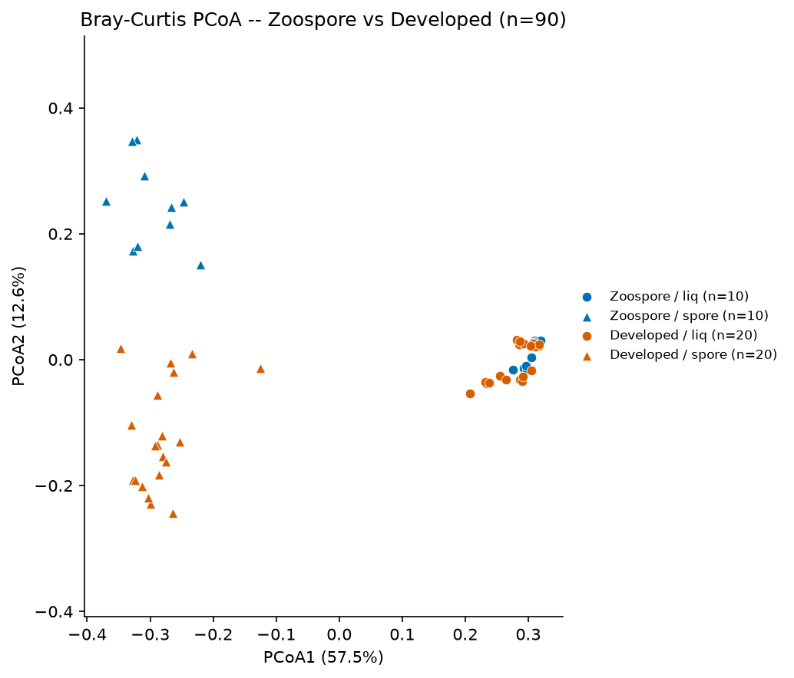
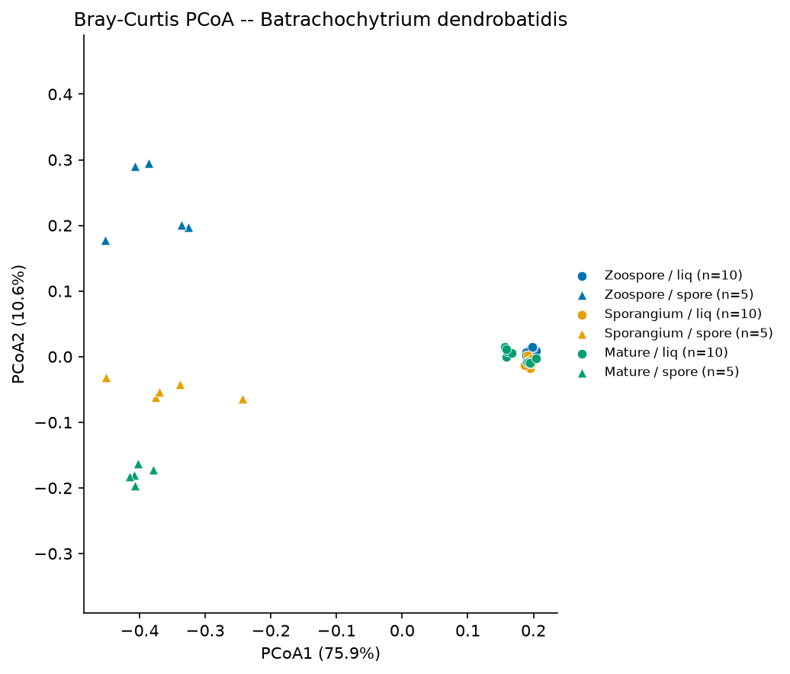
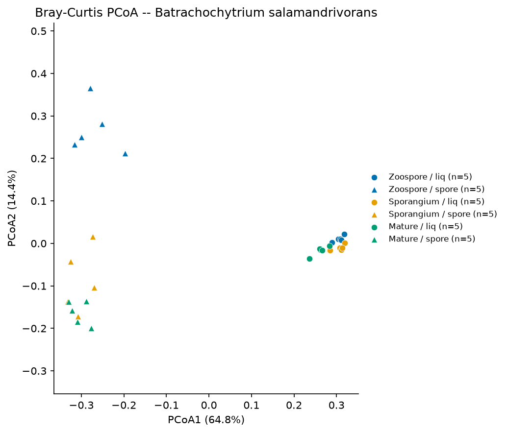

# ORDINATION

## Purpose
Bray-Curtis PCoA of the Everything-Bagel FBMN feature table (38,547 features)
across species x matrix (liq/spore) x life_stage (Zoospore/Sporangium/Mature)
for the 90 `use_in_analysis` samples. This is the Everything-Bagel port of the
sibling EB/Rhodotorula ordination pattern.

## Pipeline
1. `scripts/build_ordination_table.py` — joins curated metadata
   (`data/metdata/curated_gnps_metadata.tsv`, `use_in_analysis == True`) to the
   GNPS2 feature table
   (`data/raw/gnps2_e9838293_bagel/nf_output/feature_finding/feature_finding_results/aligned_features.csv`)
   via the 123 `<sample>.mzML Peak area` columns; writes
   `linked_data/{sample_metadata.csv, feature_abundance.csv.gz}` with the
   EB-compatible schema (`row_id, mz, rt, <sample_id>...`) plus the collapsed
   stage vocabulary `stage_group` (Zoospore | Developed =
   Sporangium+Mature) and `condition_group` (matrix_stage_group, e.g.
   `spore_Developed`), on top of the raw 6-state `condition`.
2. `scripts/pcoa_ordination.py` — prevalence filter (>=10% of samples),
   total-sum-scaling, fourth-root transform, Bray-Curtis distance, classical
   PCoA on positive eigenvalues only. Writes `figures/pcoa_all.*`,
   `figures/pcoa_condition.*` (color = the 6 sampled conditions), 
   `figures/pcoa_stagegroup.*` (color = Zoospore vs Developed),
   `figures/pcoa_axes_all.csv`, `figures/by_species/`.

Run: `pixi run build-ordination-table && pixi run pcoa-ordination`

## Results (2026-08-19/20)
- All samples: axis1 = 62.9% (matrix), axis2 = 10.7%.
- By species: Bd axis1 75.9%, Bsal axis1 70.6% (positive-eigenvalue variance).
- Consistent with sibling EB finding F-001: matrix dominates; life stage within
  liq is visibly weaker. See `.living/findings/matrix-dominates-bagel-metabolome.md`.
- `pcoa_condition.png`: the 6 sampled conditions cluster by matrix first, then
  by life stage — spore_Zoospore sits apart from spore_Developed, while the liq
  conditions overlap, consistent with F-003 (life-stage signal is in the spore
  fraction).

| *B. dendrobatidis* | *B. salamandrivorans* |
|---|---|
|  |  |

## Key inputs
- `data/raw/gnps2_e9838293_bagel/nf_output/feature_finding/feature_finding_results/aligned_features.csv`
- `data/metdata/curated_gnps_metadata.tsv`
